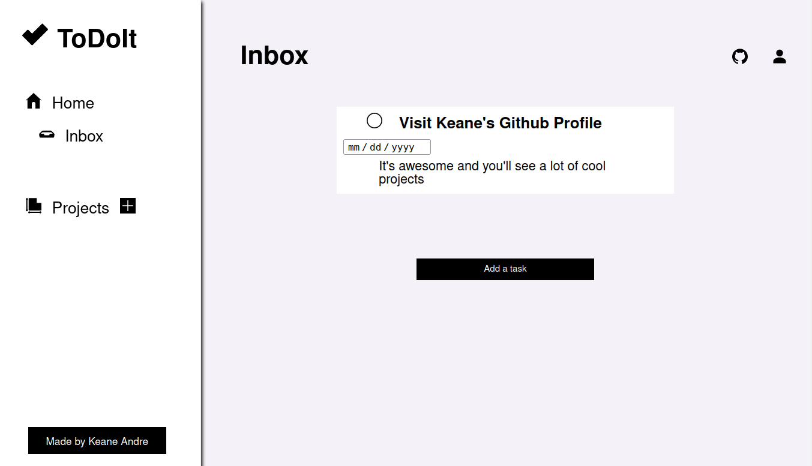

  <h1 align="center">Todo List App</h1>
  

    <strong>This was the fourth project/task for the Full-stack JavaScript path for The Odin Project. Its main functions are: to dynamically add and remove tasks, dynamically create and delete projects (seperate lists of todos), view each project's respective tasks, and remember all of those changes even if you refresh/re-visit the site. It is also fully responsive.</strong>
       
    <a href="https://keaneatl.github.io/todo-list/" target="_blank"><strong>Live Preview »</strong></a>
      
  

<h2 style="display: inline-block">Table of Contents</h2>
<ol>
  <li>
    <a href="#about-the-project">About The Project</a>
    <ul>
      <li><a href="#made-with">Made With</a></li>
      <li><a href="#things-i-learned">Things I Learned</a></li>
      <li><a href="#areas-of-improvement">Areas of Improvement</a></li>
    </ul>
  </li>

  <li><a href="#disclaimer">Disclaimer</a></li>
  <li><a href="#contact">Contact</a></li>
</ol>

## About The Project
### Made With
1. HTML
2. CSS
3. JavaScript
4. localStorage
5. JSON
6. Webpack

### Things I Learned
1. Single Responsibility Principle
2. Loosely and Tightly Coupled Objects

### Areas of improvement
1. Dates could be formatted and manipulated better with date-fns library
2. Checking whether a task belongs to a specific project could be more efficient
3. Knowing whether or not to split features/functionalities into modules

## Disclaimer
The resources I used, specifically the custom fonts installed, backgrounds, pictures, and the svg icons are only utilized for personal use, and not otherwise. 

## Contact
Keane Andre - @keaneatl (Instagram, Facebook, Twitter) - <a href="mailto:kyntltntn@protonmail.com">kyntltntn@protonmail.com</a>

